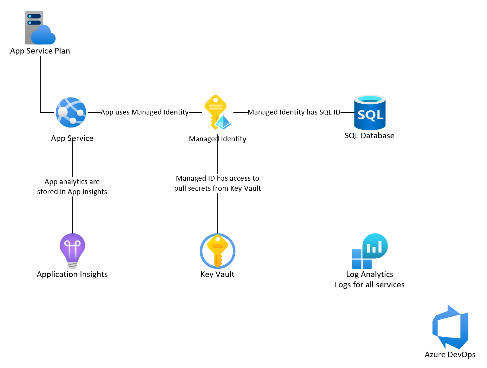

# template-repository

This repo shows you how to deploy an ASP.NET Framework web app to Azure, including the Infrastructure as Code & the Azure DevOps pipelines.



## Disclaimer

**THE SOFTWARE IS PROVIDED "AS IS", WITHOUT WARRANTY OF ANY KIND, EXPRESS OR IMPLIED, INCLUDING BUT NOT LIMITED TO THE WARRANTIES OF MERCHANTABILITY, FITNESS FOR A PARTICULAR PURPOSE AND NONINFRINGEMENT. IN NO EVENT SHALL THE AUTHORS OR COPYRIGHT HOLDERS BE LIABLE FOR ANY CLAIM, DAMAGES OR OTHER LIABILITY, WHETHER IN AN ACTION OF CONTRACT, TORT OR OTHERWISE, ARISING FROM, OUT OF OR IN CONNECTION WITH THE SOFTWARE OR THE USE OR OTHER DEALINGS IN THE SOFTWARE.**

## Prerequisites

- [Azure CLI](https://docs.microsoft.com/en-us/cli/azure/install-azure-cli)
- [Installing Azure Bicep in air-gapped environment](https://learn.microsoft.com/en-us/azure/azure-resource-manager/bicep/install#install-on-air-gapped-cloud)
- Azure subscription & resource group
- [.NET Framework 4.8](https://dotnet.microsoft.com/download/dotnet-framework/net48)

## How to use

The web app authenticates with the SQL database using a managed identity. This makes it so that there is no password that the web app must use & protect.

If you look in the `/src/net-framework/DotNetAppSqlDb/Models/MyDatabaseContext.cs` file, you will see the extra code that is needed for Entity Framework to use the managed identity.

```csharp
var conn = (System.Data.SqlClient.SqlConnection)Database.Connection;
var credential = new Azure.Identity.DefaultAzureCredential(new DefaultAzureCredentialOptions { ManagedIdentityClientId = ConfigurationManager.AppSettings["ManagedIdentityClientId"] });
var token = credential.GetToken(new Azure.Core.TokenRequestContext(new[] { "https://database.windows.net/.default" }));
conn.AccessToken = token.Token;
```

The web app pulls secrets from Key Vault using a managed identity. You can see the link between the web app & Key Vault in the `/infra/app-service-net-framework.bicep` file.

```bicep
{
  name: 'SuperSecretData'
  value: '@Microsoft.KeyVault(VaultName=${keyVault.name};SecretName=SuperSecretData)'
}
```

This value `SuperSecretData` is an app setting that will override the value that is stored in the `/src/net-framework/DotNetAppSqlDb/Web.config` file.

```xml
<appSettings>
    <add key="SuperSecretData" value="local value"/>
    ...
```

By taking advantage of the managed identity, the web app can access the SQL database & Key Vault without having to store any secrets in the web app.

## Manual Deployment

### Deploying the Azure infrastructure

1.  Modify the `/infra/env/dev.parameters.json` file (and other environments if needed) to match your environment.

1.  Open a command prompt & navigate to the local repo.

1.  Authenticate your local environment & set your Azure subscription.

    ```shell
    az login
    az account set --subscription <subscription-id>
    ```

1.  Run the following command to deploy the infrastructure

    ```shell
    az deployment group create -g <resource-group-name> --template-file ./infra/main.bicep --parameters ./infra/env/dev.parameters.json
    ```

### Add secret to Key Vault manually

1.  Navigate to the [Azure portal](https://portal.azure.com) and navigate to your resource group.

1.  Open the Key Vault resource created by the deployment.

1.  Click on **Secrets** blade and click on **Generate/Import**.

1.  Add a secret called **SuperSecretData** and provide a value. Click on **Create**.

### Set up access to the SQL database via Managed Identity for the web app

1.  Navigate to the [Azure portal](https://portal.azure.com) and navigate to your resource group.

1.  Open the SQL server (not database) resource created by the deployment.

1.  Click on **Networking** blade and click on **Add current client IPv4 address** (this adds the IP address of your machine to the SQL firewall rules).

1.  Click on the **SQL databases** blade and open the database created by the deployment.

1.  Click on **Query editor** blade and click on the **Continue** button under the **Active Directory authentication** section.

1.  Run the following SQL DDL commands to create a SQL identity that is linked to the Managed Identity that the web app will use to login to the database. Change the **<identity-name>** to match the name of the Managed Identity resource created by the deployment (look in the resource group for the Managed Identity resource name).

    ```sql
    CREATE USER [<identity-name>] FROM EXTERNAL PROVIDER;
    ALTER ROLE db_datareader ADD MEMBER [<identity-name>];
    ALTER ROLE db_datawriter ADD MEMBER [<identity-name>];
    ALTER ROLE db_ddladmin ADD MEMBER [<identity-name>];
    GO
    ```

### Deploying the web app

1.  Open the `src/net-framework/DotNetAppSqlDb.sln` solution file in Visual Studio

1.  Build the solution

1.  Right-click on the `DotNetAppSqlDb` project and select **Publish**.

1.  Click on the **New** button to create a new publish profile.

1.  Select **Azure** as the publish target and click on **Next**.

1.  Select **Azure App Service (Windows)** as the specific target and click on **Next**.

1.  Select the **App Service** created by the deployment and click on **Finish**.

1.  Click on **Publish** button to deploy the web app to Azure.

## Azure DevOps YAML Pipeline Deployment

### Update parameter files

1.  Modify the `/ado/env/dev.yml` file (and other environments if needed) to match your environment.

### Create 3 environments

1.  In Azure DevOps, select your **Project**.

1.  Under the **Pipelines** section, select **Environments**.

1.  Create 3 environments named **dev**, **tst** and **prd** (these names are what are in the `/ado/env/dev.yml` file and are used by the YAML pipelines to control deployments (approvals, deployment hours, locks, etc)).

### Create pipelines

1.  Under the **Pipelines** section, select **Pipelines**.

1.  Click on **New pipeline**.

1.  Select **Azure Repos Git** as the source and select your repo.

1.  Select **Existing Azure Pipelines YAML file** and select the `/ado/infra/pipeline.yml` file. Click **Continue**.

1.  Click **Run** to begin deployment. Note that you may have authorize the pipeline to use the service connection and/or the environment the first time it runs.

1.  Follow similar steps for the `/ado/webApp/build/pipeline.yml` and the `/ado/webApp/deploy/pipeline.yml`

## Links

- [App Service](https://learn.microsoft.com/en-us/azure/app-service/overview)
- [Azure SQL](https://learn.microsoft.com/en-us/azure/azure-sql/azure-sql-iaas-vs-paas-what-is-overview?view=azuresql)
- [Azure Monitor](https://learn.microsoft.com/en-us/azure/azure-monitor/overview)
- [Key Vault](https://learn.microsoft.com/en-us/azure/key-vault/general/overview)
- [Managed Identity](https://learn.microsoft.com/en-us/azure/app-service/tutorial-connect-msi-sql-database?tabs=windowsclient%2Cef%2Cdotnet)
- [Azure DevOps YAML Pipelines](https://nam06.safelinks.protection.outlook.com/?url=https%3A%2F%2Fdocs.microsoft.com%2Fen-us%2Fazure%2Fdevops%2Fpipelines%2Fget-started%2Fkey-pipelines-concepts%3Fview%3Dazure-devops)
